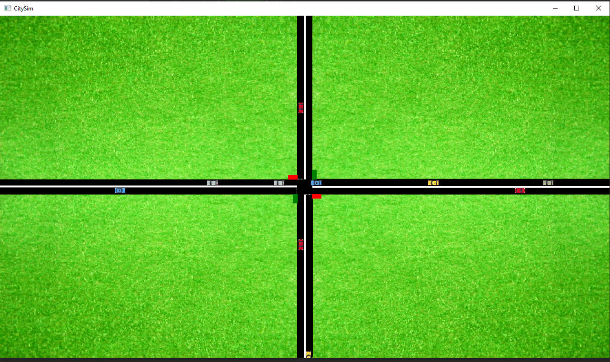

# CitySim

A [Traffic simulation](https://en.wikipedia.org/wiki/Traffic_simulation) written in Java using JavaFX as a GUI.

## Features

* Car movement
* Crossroad
* Lights

## Requirements

* Java 10

## Screenshots

